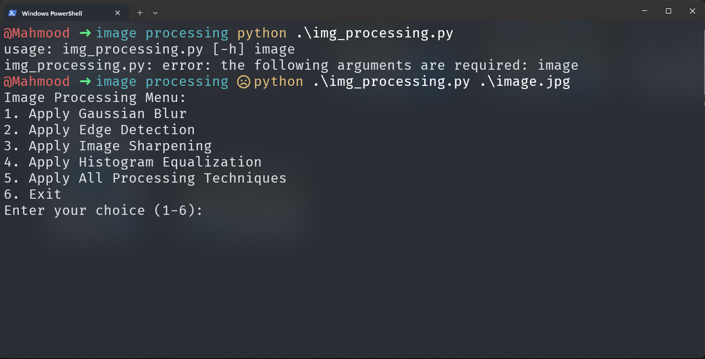
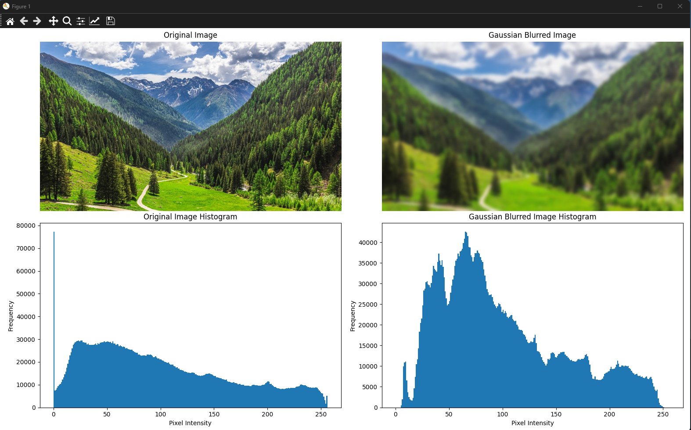
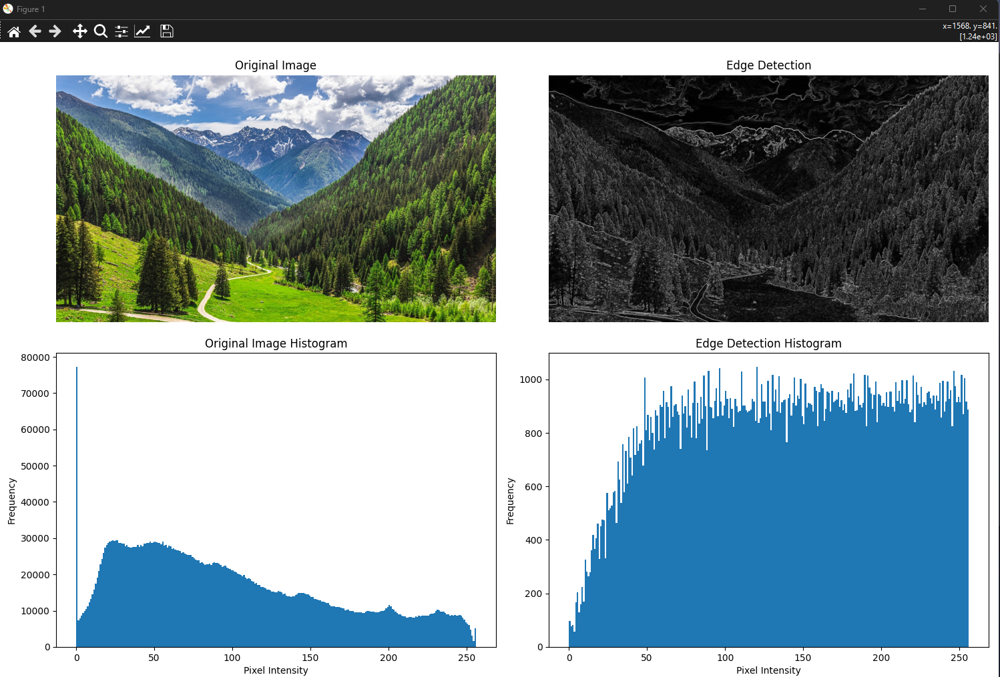
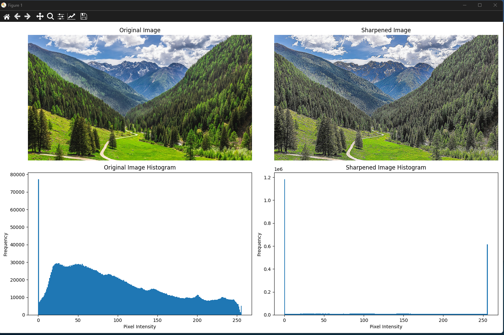
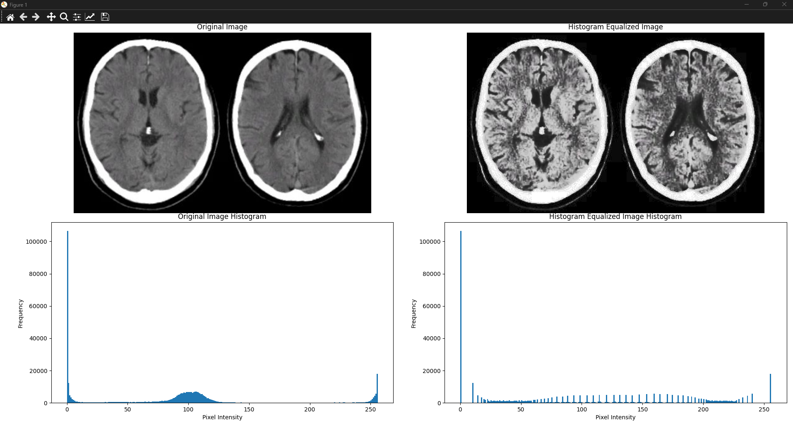
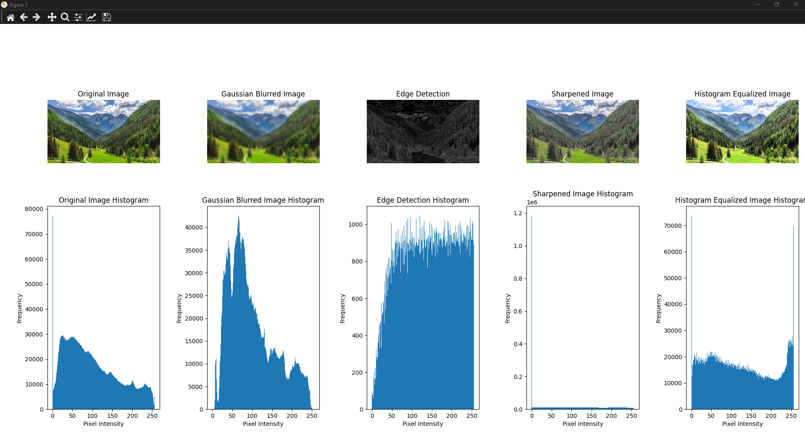
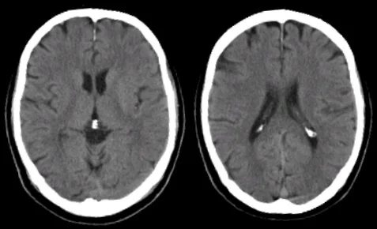

# Image Processing Pipeline

This repository contains a Python script that demonstrates various image processing techniques using OpenCV and NumPy.

## Features

- Apply Gaussian Blur
- Apply Edge Detection
- Apply Image Sharpening
- Apply Histogram Equalization
- Display images and histograms

## Usage

Run the script with the path to the image file:

```sh
python img_processing.py path/to/image.jpg
```

## Menu Options

1. Apply Gaussian Blur
2. Apply Edge Detection
3. Apply Image Sharpening
4. Apply Histogram Equalization
5. Apply All Processing Techniques
6. Exit

## Example Outputs

### Menu


### Gaussian Blur


### Edge Detection


### Image Sharpening


### Histogram Equalization


### All Options Applied


### Example CT Scan


## Requirements

- Python 3.x
- OpenCV
- NumPy
- Matplotlib

## Installation

You can install the required libraries using pip:

```sh
pip install opencv-python-headless numpy matplotlib
```

## Author

Mahmood Abu Gneam

## License

This project is licensed under the MIT License.
